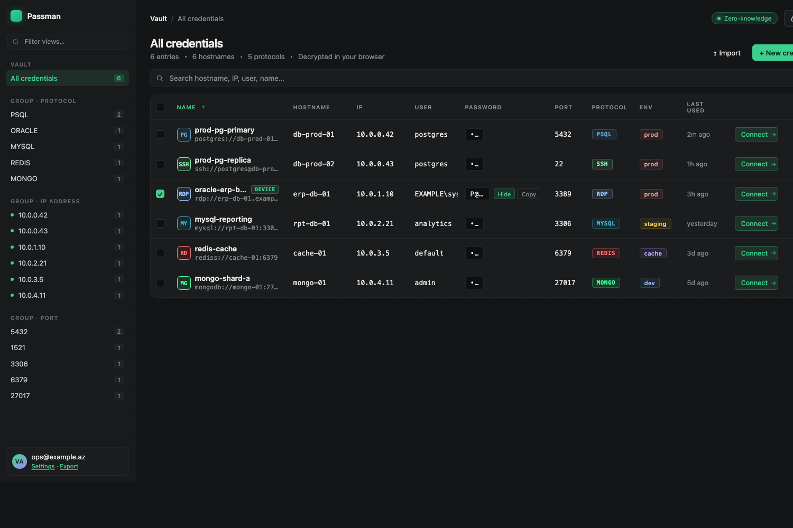
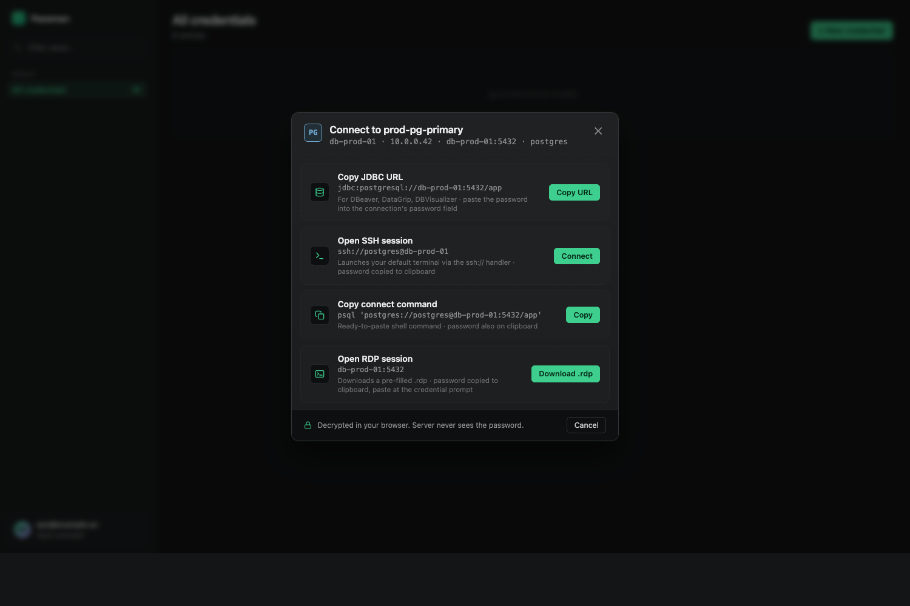
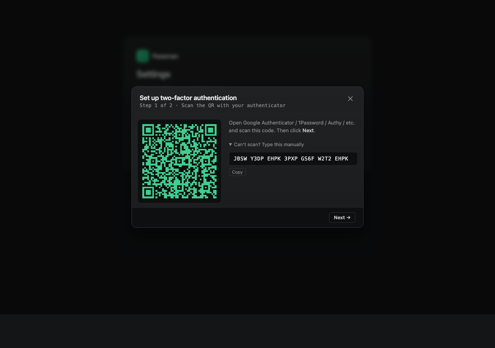

# Passman

A zero-knowledge password manager built for DBAs and infrastructure teams.
Vault data is encrypted on the client with a key derived from your master
password, and the server only ever stores ciphertext + KDF parameters. A
database breach leaks nothing usable.



The vault treats credentials as connection targets, not just `name +
password` rows: every entry carries protocol, hostname, IP, port, and
optional service-name / Windows-domain / database fields. One click on
**Connect →** turns a saved credential into a working session — a JDBC
URL for DBeaver / DataGrip / DBVisualizer, a launched SSH terminal, a
ready-to-paste `psql` / `mysql` / `sqlplus` command, or a downloadable
`.rdp` file. The password lands on the clipboard with a 30-second
auto-clear; the server still sees only ciphertext.



Login is optionally protected by **TOTP 2FA** (Google Authenticator,
1Password, Authy, …) with single-use recovery codes. Vault contents
remain zero-knowledge regardless — even if the OTP secret leaks, the
master key the server never sees is still the only thing that decrypts
the vault.



## Architecture at a glance

```
┌─────────────────┐  auth_key (one-way)   ┌───────────────────┐
│   Web vault     │ ────────────────────▶ │  FastAPI server   │
│   (React)       │ ◀──────────────────── │  PostgreSQL       │
│                 │  encrypted blobs only │  Argon2id hash    │
└─────────────────┘                       └───────────────────┘
        ▲
        │  shares @passman/core (Argon2id KDF + AES-GCM)
        ▼
┌─────────────────┐
│ Browser ext.    │ — Manifest V3, exact-origin autofill
│ (Chrome MV3)    │
└─────────────────┘
```

## Repository layout

| Path                  | Purpose                                                     |
| --------------------- | ----------------------------------------------------------- |
| `server/`             | Python FastAPI backend (zero-knowledge auth + vault CRUD).  |
| `packages/core/`      | Shared TypeScript crypto: Argon2id KDF, AES-256-GCM.        |
| `packages/web/`       | React/Vite vault UI.                                        |
| `packages/extension/` | Manifest V3 Chrome extension for autofill.                  |
| `.github/workflows/`  | CI: lint, typecheck, unit + E2E tests, CodeQL, audits.      |
| `docs/`               | Architecture and security docs.                             |

Read the full design in [`docs/ARCHITECTURE.md`](docs/ARCHITECTURE.md), the
threat model in [`docs/SECURITY.md`](docs/SECURITY.md), a screenshot walkthrough
of every screen in [`docs/USER_GUIDE.md`](docs/USER_GUIDE.md), and the
white-label branding guide in [`docs/BRANDING.md`](docs/BRANDING.md).

## Installation

### Prerequisites

| Tool          | Version  | Purpose                                     |
| ------------- | -------- | ------------------------------------------- |
| Python        | 3.11+    | Backend runtime                             |
| Node.js       | 20+      | Web vault and extension build               |
| npm           | 10+      | Bundled with Node.js                        |
| Docker        | 20.10+   | Local PostgreSQL (or use a native install)  |
| Google Chrome | 120+     | Browser extension (optional)                |

Verify with:

```bash
python3 --version
node --version
npm --version
docker --version
```

### 1. Clone the repository

```bash
git clone https://github.com/valehdba/passman.git
cd passman
```

### 2. Start PostgreSQL

The bundled `docker-compose.yml` provisions a dev-grade Postgres 16 instance
on `localhost:5432`:

```bash
docker compose up -d
docker compose ps          # confirm STATUS is "healthy"
```

If you prefer a native install, create a database and user matching
`docker-compose.yml`, then point `DATABASE_URL` (next step) at it.

### 3. Configure environment

Copy the template, then generate a strong JWT secret and paste it in:

```bash
cp .env.example .env
openssl rand -hex 64       # copy the output

# Open .env and set:
#   JWT_SECRET=<paste here>
```

Other variables in `.env.example` have sensible defaults for local
development. See [Configuration](#configuration) below for the full list.

### 4. Install and run the backend

```bash
cd server

python3 -m venv .venv
source .venv/bin/activate          # macOS/Linux
# .venv\Scripts\activate           # Windows PowerShell

pip install --upgrade pip
pip install -e ".[dev]"

# Apply database schema
alembic upgrade head

# Start the API on http://localhost:8000
uvicorn passman.main:app --reload --port 8000
```

Verify it's up in another terminal:

```bash
curl http://localhost:8000/healthz
# -> {"status":"ok"}
```

Interactive OpenAPI docs are at <http://localhost:8000/docs>.

### 5. Build and run the web vault

In a new terminal at the repo root:

```bash
npm install
npm run build --workspace=@passman/core   # core must be built first
npm run dev  --workspace=@passman/web
```

Open <http://localhost:5173>. Vite proxies `/api/*` to the backend on
port 8000, so CORS isn't a concern in development.

### 6. (Optional) Browser extension

The extension's runtime code typechecks cleanly, but a loadable Chrome
bundle requires a Vite multi-entry config that is tracked for a follow-up.
Until then:

```bash
# Verify the source compiles
npm run typecheck --workspace=@passman/extension
```

The extension is not currently loadable into Chrome from this repo. The
web vault (step 5) is the primary client.

## Configuration

All configuration is via environment variables (12-factor). For local
development they live in `.env` at the repo root; for production set
them in your orchestrator's secret store.

### Required

| Variable       | Purpose                                                                  |
| -------------- | ------------------------------------------------------------------------ |
| `JWT_SECRET`   | 64+ random bytes used to sign access tokens. Generate with `openssl rand -hex 64`. The server refuses to start in production mode if this is left at its default. |
| `DATABASE_URL` | SQLAlchemy async URL. Default targets the bundled docker-compose Postgres. |
| `ENV`          | One of `development`, `test`, `production`. Production mode enforces strict `JWT_SECRET` validation. |

### Tuning (optional)

| Variable                      | Default       | Purpose                                                  |
| ----------------------------- | ------------- | -------------------------------------------------------- |
| `LOG_LEVEL`                   | `INFO`        | Standard Python log level.                               |
| `ACCESS_TOKEN_TTL_SECONDS`    | `900` (15m)   | JWT access token lifetime.                               |
| `REFRESH_TOKEN_TTL_SECONDS`   | `2592000` (30d) | Refresh token lifetime.                                |
| `SERVER_ARGON2_TIME_COST`     | `2`           | Server-side Argon2id iterations (real users + dummy verifies stay in lockstep automatically). |
| `SERVER_ARGON2_MEMORY_COST`   | `19456`       | Server-side Argon2id memory in KiB (~19 MiB).            |
| `SERVER_ARGON2_PARALLELISM`   | `1`           | Server-side Argon2id parallelism.                        |
| `CLIENT_ARGON2_TIME_COST`     | `3`           | Default Argon2id cost returned to new clients.           |
| `CLIENT_ARGON2_MEMORY_COST`   | `65536`       | Default client Argon2id memory in KiB (~64 MiB).         |
| `CLIENT_ARGON2_PARALLELISM`   | `4`           | Default client Argon2id parallelism.                     |
| `CORS_ORIGINS`                | `["http://localhost:5173","chrome-extension://*"]` | JSON list of allowed origins for the API. |
| `LOGIN_ATTEMPTS_PER_15MIN`    | `10`          | Reserved for future rate limiting.                       |

When you raise `SERVER_ARGON2_*` cost factors, existing users are
silently migrated to the new policy on their next successful login —
no password reset is needed.

## First use

1. Open <http://localhost:5173>.
2. Click **Create a vault**.
3. Enter your email and a master password (12 characters minimum).
4. **Write the master password down somewhere safe.** Passman stores no
   recovery channel — if you forget it, the vault is permanently unreadable.
5. Click **Create vault**, then log in with the same credentials.
6. Add your first item via **+ Add login**.

## Testing

```bash
# Backend (32 tests, ~83% coverage)
cd server
pytest

# TypeScript packages (unit tests across workspaces)
npm test --workspaces --if-present

# Full end-to-end (TS client → live FastAPI on real Postgres)
PASSMAN_INTEGRATION_URL=http://localhost:8000 \
  npm test --workspace=@passman/core
```

## Production deployment

1. Set `ENV=production` and a strong `JWT_SECRET`. The config refuses to
   start with the default secret in production mode.
2. Front the API with TLS (nginx, Caddy, or a managed terminator).
3. Serve the web vault from a stable origin and add it to `CORS_ORIGINS`.
4. Run `alembic upgrade head` as a separate deploy step before booting
   workers; never let a user request race a schema migration.
5. Rotate `JWT_SECRET` periodically — this invalidates existing sessions,
   which is the intended behavior.
6. Consider edge rate limiting in addition to whatever the application
   eventually adds; the in-app middleware is not yet wired up.

## Contributing

Issues and PRs welcome. See [`docs/DEVELOPMENT.md`](docs/DEVELOPMENT.md) for
the workflow, conventional-commit guidance, and a rundown of common
commands.

## Security

- **Found a vulnerability?** Email the maintainer privately rather than
  opening a public issue.
- See [`docs/SECURITY.md`](docs/SECURITY.md) for the full threat model.

## License

TBD — add a `LICENSE` file before publishing.
