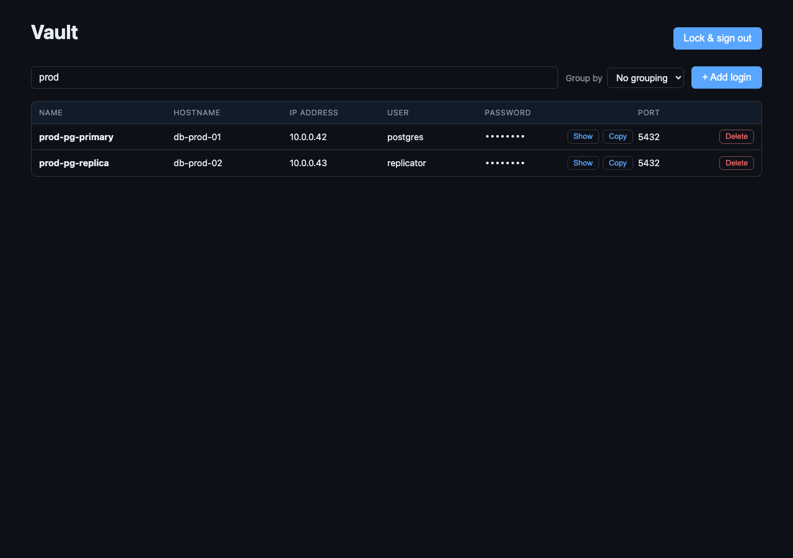
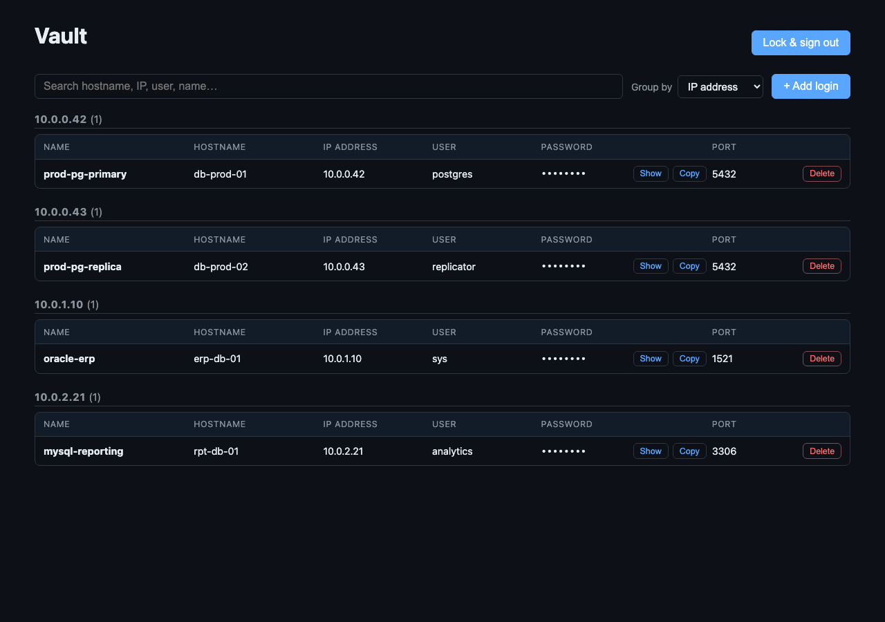

# Passman — User guide

This guide walks through every screen of the Passman web vault and the
companion Chrome extension, from creating a vault to autofilling a saved
credential.

> **Zero-knowledge reminder.** The screens below all run client-side. The
> server only ever sees ciphertext + your KDF parameters. Your master
> password and decryption key never leave the browser.

The screenshots are reproducible from `docs/preview/*.html` — see
[Reproducing the screenshots](#reproducing-the-screenshots) at the end.

---

## 1. Create your vault

Open `http://localhost:5173` and click **Create a vault** on the login
page. The registration screen looks like this:


Fields:

- **Email** — used for login + future recovery hints; never stored
  alongside your plaintext password.
- **Master password** — minimum 12 characters. **Write it down.** Passman
  has no recovery channel; if you forget it, the vault is permanently
  unreadable.
- **Confirm password** — typo guard.

When you submit, the browser:

1. Generates a random 16-byte KDF salt and a random 256-bit symmetric
   vault key.
2. Derives a master key from your password via Argon2id.
3. Encrypts the symmetric key with the master key (AES-256-GCM).
4. Sends only the ciphertext + salt + KDF parameters to the server.

You're then redirected to the login screen.

---

## 2. Unlock your vault


Enter the same email and master password. The browser:

1. Asks the server for your KDF parameters (the server returns plausible
   decoy parameters for unknown emails, so attackers can't enumerate).
2. Re-derives the master key locally.
3. Derives a one-way **auth key** from the master key + password and
   sends only that to the server. The server has no way to reverse it
   into your password.
4. On a successful login, decrypts the symmetric key locally.

If decryption fails (wrong password) you'll see *"Vault decryption
failed."*; if the server rejects the auth key you'll see *"Invalid email
or password."*

---

## 3. The vault — main grid

After unlocking you land on the vault grid, optimised for
infrastructure credentials (DBs, hosts, services):


Each row shows:

| Column        | What it holds                                          |
| ------------- | ------------------------------------------------------ |
| **Name**      | Friendly label (e.g. `prod-pg-primary`).               |
| **Hostname**  | DNS name or short alias (e.g. `db-prod-01`).           |
| **IP address**| IPv4 / IPv6 address of the host.                       |
| **User**      | Account name (e.g. `postgres`, `sys`).                 |
| **Password**  | Masked by default. **Show / Hide** + **Copy** buttons. |
| **Port**      | Service port (e.g. `5432`, `1521`).                    |
| **Actions**   | Per-row **Delete**.                                    |

All values are decrypted in-browser after sign-in; the server never sees
plaintext.

### 3a. Search

Type into the search box at the top of the page. The grid filters in
real time across **name, hostname, IP, user, port, URL and notes** —
case-insensitive substring match, performed locally on already-decrypted
items. Nothing about your query reaches the server.



### 3b. Group by

Use the **Group by** dropdown to bucket rows under a section heading.
Available keys: `Hostname`, `IP address`, `User`, `Port`. Items missing
the chosen field land in `(unspecified)`.



### 3c. Add a new credential

Click **+ Add login** to open the inline form below the grid.


- **Name** and **Password** are required. Everything else is optional —
  empty fields are stripped before encryption so the ciphertext stays
  small.
- **Port** accepts `0–65535`. It's stored as a number, so grouping and
  numeric search both work.
- **URL** is free-form; keep it for browser autofill (e.g.
  `https://app.example.com/login`) or as a connection string for DB
  tooling.

Click **Save**. The form encrypts the JSON payload with your symmetric
key, sends only the ciphertext to `POST /api/vault/items`, and the new
row appears in the grid after a refresh.

### 3d. Reveal & copy a password

In the **Password** column:

- **Show** flips the cell from `••••••••` to the cleartext value
  (in-page only — toggling **Hide** masks it again).
- **Copy** writes the password to the system clipboard. Most browsers
  clear the clipboard automatically after a short period.

### 3e. Delete a row

The red **Delete** button on the right asks for confirmation, then
issues `DELETE /api/vault/items/<id>`. The server has no way to
recover deleted ciphertext.

### 3f. Lock the vault

Top-right **Lock & sign out** revokes your refresh token server-side
and clears the in-memory symmetric key. You'll have to re-enter the
master password to come back in.

---

## 4. Chrome extension

> ⚠️ The extension's runtime code typechecks cleanly, but a loadable
> Chrome bundle requires a Vite multi-entry config that is tracked for a
> follow-up. The screenshots below show the popup as it will appear once
> the extension is loadable. The web vault remains the primary client
> for now.

### 4a. Locked popup

Click the Passman toolbar icon when the vault is locked (or freshly
installed):


Enter the same email + master password you use on the web vault. The
extension's service worker performs the same client-side derivation +
unlock, then keeps the decrypted symmetric key in memory only.

### 4b. Unlocked popup

Once unlocked the popup confirms the active session and offers a single
**Lock vault** button:


While unlocked, the content script can offer **exact-origin autofill**
on saved logins — it will only suggest a credential when the page's
origin matches the URL stored on the item.

Hitting **Lock vault** wipes the in-memory key; the next popup open
returns to the locked screen.

---

## 5. Tips

- **Master password length matters more than complexity.** Argon2id is
  tuned to take ~250 ms even on a fast laptop; a 16-character random
  passphrase is a far stronger choice than a clever 8-character one.
- **One vault per machine works fine.** Sessions are bound to refresh
  tokens, not browsers — sign in from as many devices as you like.
- **Treat the URL field as searchable.** It's included in the search
  index so you can type a substring of `postgres://…` to find a DB
  credential by connection string.
- **DB-style entries.** For database credentials, fill **Hostname**,
  **IP**, **User**, **Password**, and **Port**; that's the minimum
  needed to reconstruct a `psql` / `mysql` / `sqlplus` invocation
  directly from the row.

---

## Reproducing the screenshots

Every image in this guide is generated from a self-contained HTML
mockup under `docs/preview/`. Each mockup loads the real
`packages/web/src/styles.css`, so the rendering matches the live app.

1. Start the bundled static server:

   ```bash
   node docs/preview/server.mjs
   # previews http://127.0.0.1:4173/
   ```

2. Browse `http://127.0.0.1:4173/docs/preview/` for an index of all
   pages.

3. Re-capture the PNGs with Chrome headless:

   ```bash
   CHROME="/Applications/Google Chrome.app/Contents/MacOS/Google Chrome"
   for page in register login vault vault-search vault-grouped vault-add; do
     "$CHROME" --headless --disable-gpu --hide-scrollbars \
       --window-size=1280,900 \
       --screenshot="docs/img/${page}.png" \
       "http://127.0.0.1:4173/docs/preview/${page}.html"
   done
   for page in extension-locked extension-unlocked; do
     "$CHROME" --headless --disable-gpu --hide-scrollbars \
       --window-size=400,360 \
       --screenshot="docs/img/${page}.png" \
       "http://127.0.0.1:4173/docs/preview/${page}.html"
   done
   ```

   On Linux replace `$CHROME` with `chromium --headless=new` (or
   `google-chrome`).

If the live UI changes, refresh the mockups in `docs/preview/` and
re-run the loop.
